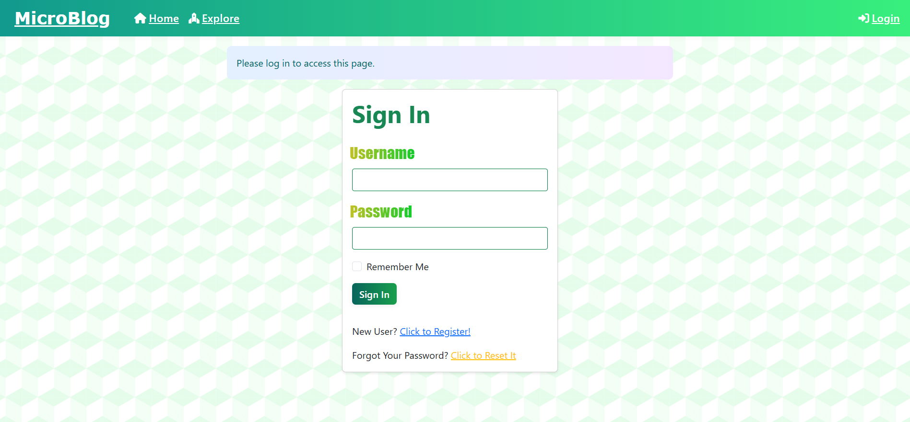
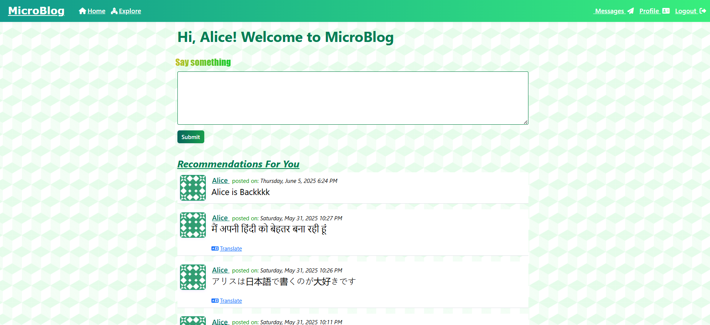
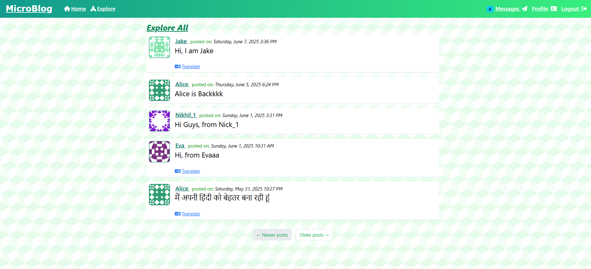
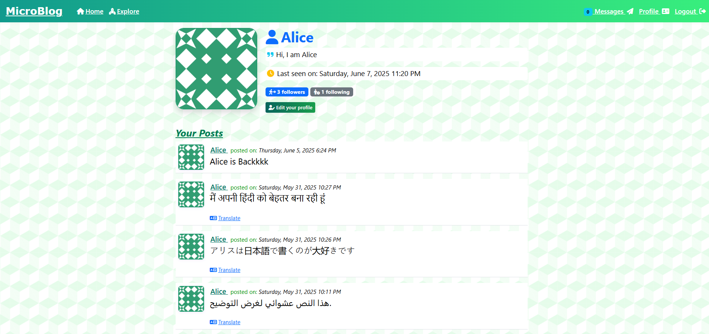
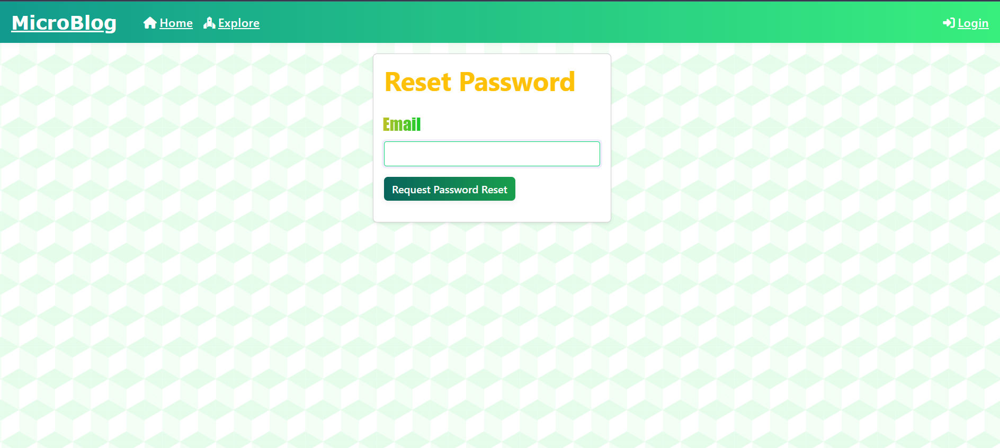
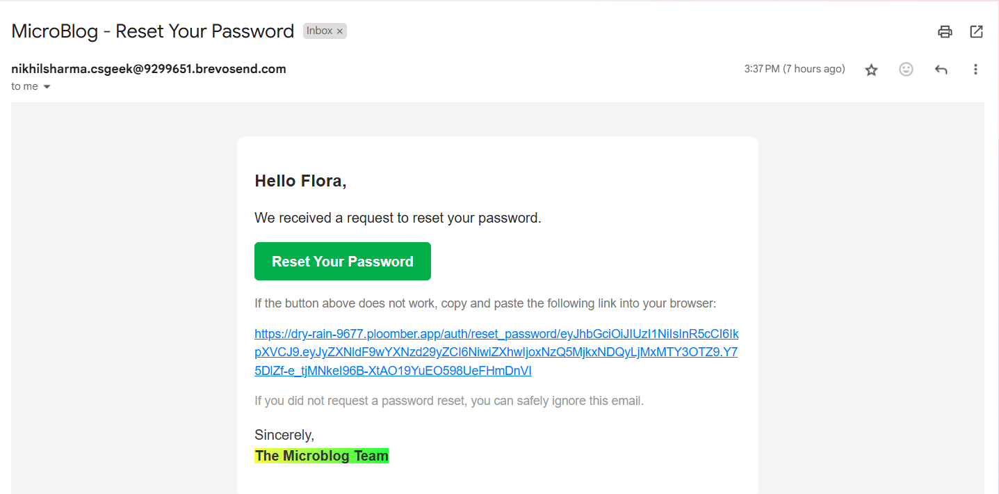

# 🌱 **MicroBlog** – An Advanced Blog Application

<h1 align="center" id="title">🌿 MicroBlog - A Flask Powered Social Blogging App 🌿</h1>

<p align="center" id="description"><em>Developed a multi-feature rich blog platform using Python Flask, deployed on Ploomber.</em></p>

---

## ✅ **🧐 Key Features at a Glance**

Here are the core features that make MicroBlog stand out:

1. 🔐 **User Authentication** – Login & Registration system  
2. ✉️ **Secure Password Reset** – Using Brevo SMTP + JWT Tokenization  
3. 📝 **Post Creation** – Users can create and view posts  
4. 🏠 **Homepage Feed** – See posts from followed users  
5. 🌍 **Explore Feed** – Discover posts from all users  
6. 💬 **Direct Messaging** – Users can send & receive messages  
7. 🧑‍🎨 **Profile Editing** – Customizable user profiles  
8. 🔁 **Password Recovery** – Reset via secure email link  
9. 🚨 **Real-Time Notifications** – New messages alert every 10s  
10. 🌐 **Multilingual Posts** – Post and view in local languages  
11. 🔁 **On-the-Fly Translation** – Translate posts with one click  

---

## 💚 **🛠️ Technologies & Tools Used**

### 🔧 **Backend & Logic**
- 🐍 **Python Flask** – Lightweight backend framework
- 🧠 **SQLAlchemy + SQLite** – ORM + Database
- 🔑 **Flask-Login & WTForms** – Auth & form management
- 🛡️ **Werkzeug & CSRF Tokens** – Password hashing & form security
- 🔐 **JWT** – Secure token-based reset flow
- 📤 **Flask-Mail + Brevo SMTP** – Email services

### 🎨 **Frontend & UI**
- 🧩 **Jinja2** – Templating for HTML rendering
- 🪄 **Bootstrap (w/ Macros)** – Sleek UI components
- ⏱️ **Moment.js + Flask-Moment** – Local timezone display
- 💬 **AJAX** – For dynamic features like translation

### 🌍 **Internationalization**
- 🌐 **Flask-Babel** – L10n & i18n support
- 🔄 **PythonAnywhere Translation API** – Real-time post translation

### 🧱 **Architecture & Practices**
- 📁 **Blueprints** – Modular app structure
- 🔍 **REST APIs** – Extendable endpoints
- 🔁 **Pagination** – For efficient post navigation
- 🧪 **Unittesting** – Tested with built-in Flask unit tests
- ⚙️ **Shell Context, .env, Logging** – For dev best practices
- 🎭 **Custom Error Pages** – For 404, 502, etc.
- 🔁 **Rotating Log Handler** – Keeps logs organized

---

## 💻 **Built With**

```text
Python Flask, Jinja2, SQLAlchemy, Flask-WTF, Flask-Migrate, Flask-Login,
Flask-Mail, pyjwt, Brevo SMTP, WTForms, Bootstrap, Flask-Moment,
Flask-Babel, AJAX, HTML, CSS, JS, Werkzeug, Logging, Unittest, Gravatar, etc.
```

---

## 🚀 **Deployment**

- 📡 Hosted on **Ploomber Cloud**
- 🔐 Secrets & Environment handled via `.env` and `.flaskenv`

---

## 📷 **Screenshots**

### Sign In


### Register


### Homepage


### Explore All


### Messages 


### User Profile


### Reset Password


### Reset Link



---

## 📣 **Feedback & Contributions**

If you have any suggestions, issues, or contributions, feel free to open a pull request or issue, or Contact via Gmail.

---